# INTRICATION OF TERRAFORM WITH AWS TO LAUNCH THE WHOLE INFRASTRUCTURE USING IAAC INFRASTRUCTURE AS CODE,WITH JUST 1 GO WEBSITE LAUNCHED.
This intrication will be more helpful when we will use hybrid cloud or multi cloud or hybrid multi cloud with kubernetes on backened holding the deployment of our pods with the instance running through EKS also thats elastic kubernetes service.THis ca be also intricated to jenkins so as soon as code changed by developer by setting github webhooks they auto roll or update so now this can said as cloudops.For this we have to set an static ip so its constant and from that we can write code to write code for jenkins shell command it will auto apply and init or validate.

TASK DETAILS:

1. Create the key and security group which allow the port 80.
2. Launch EC2 instance.
3. In this Ec2 instance use the key and security group which we have created in step 1.
4. Launch one Volume (EBS) and mount that volume into /var/www/html
5. Developer have uploded the code into github repo also the repo has some images.
6. Copy the github repo code into /var/www/html
7. Create S3 bucket, and copy/deploy the images from github repo into the s3 bucket and change the permission to public readable.
8 Create a Cloudfront using s3 bucket(which contains images) and use the Cloudfront URL to  update in code in /var/www/html

Optional
1) Those who are familiar with jenkins or are in devops AL have to integrate jenkins in this task wherever you feel can be integrated
2) create snapshot of ebs --> FOR FUTURE REFERANCE FOR MAKING AN AMI FROM THIS

Above task should be done using terraform

IF U LIKED MY PROJECT THEN GIVE A LIKE AND COMMENT IN MY LINKEDIN---> https://www.linkedin.com/posts/v-roshan-kumar-patro-6222741a2_my-cloud-terraform-intricated-aws-website-activity-6679366488291454976-6xiK

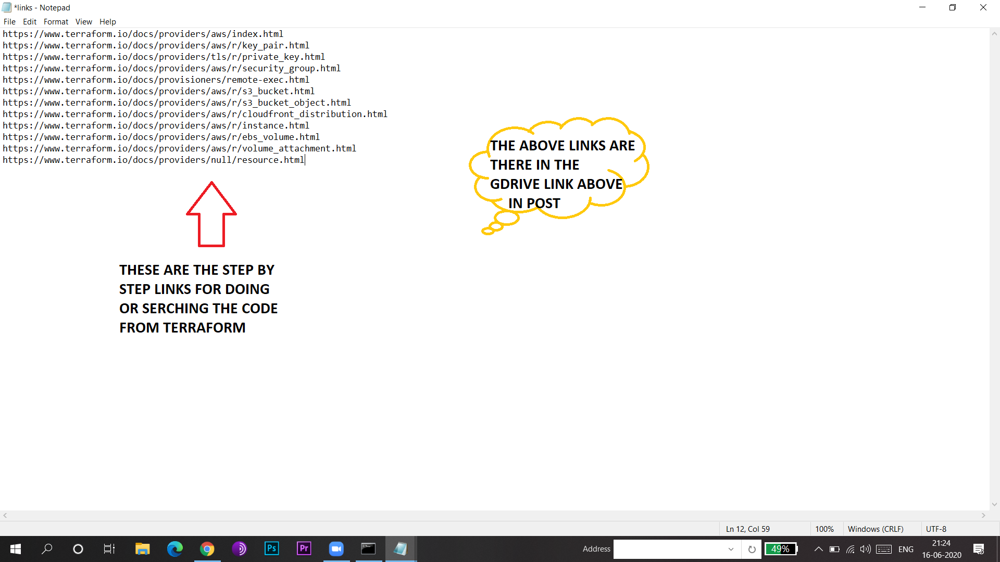
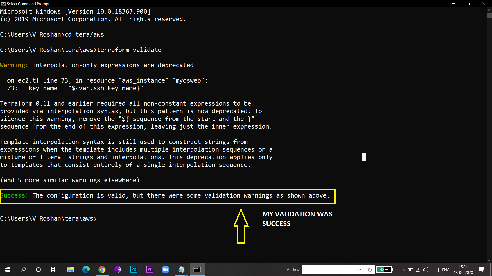
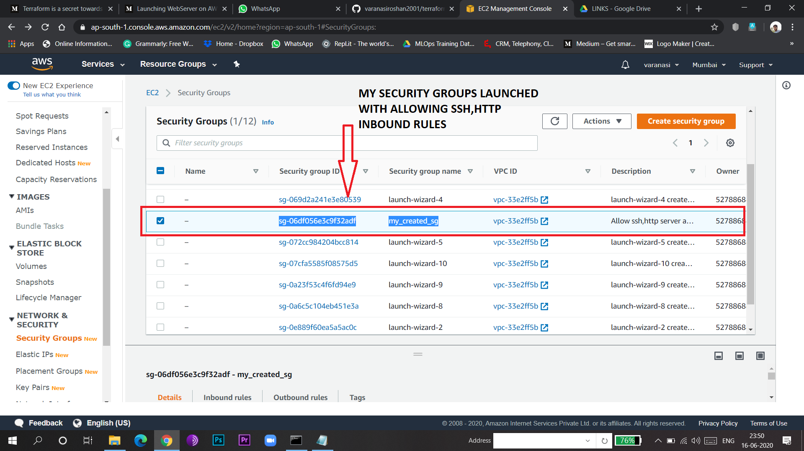
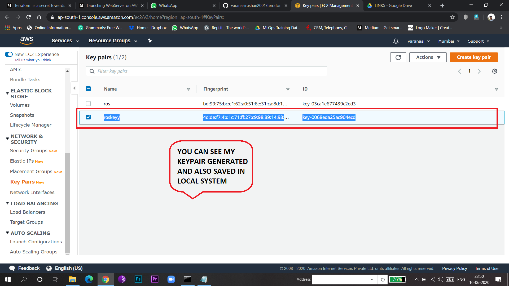
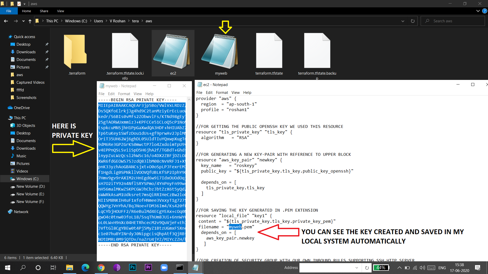
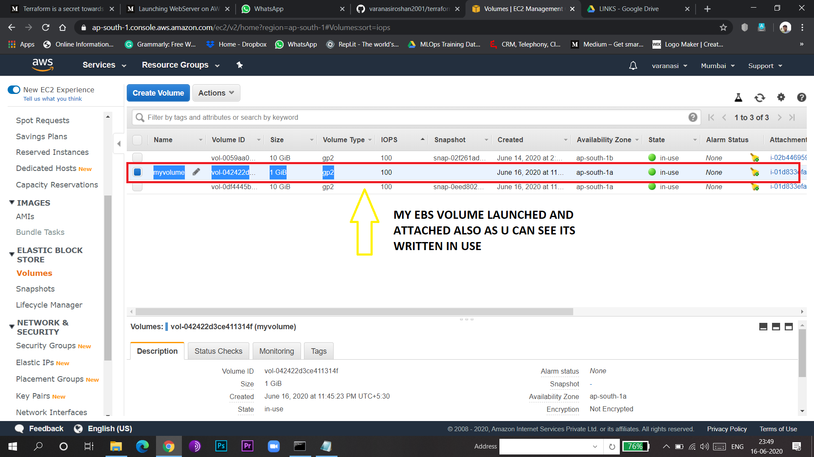
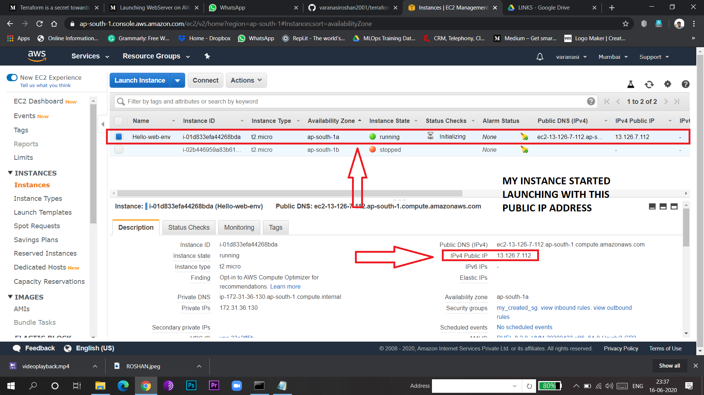
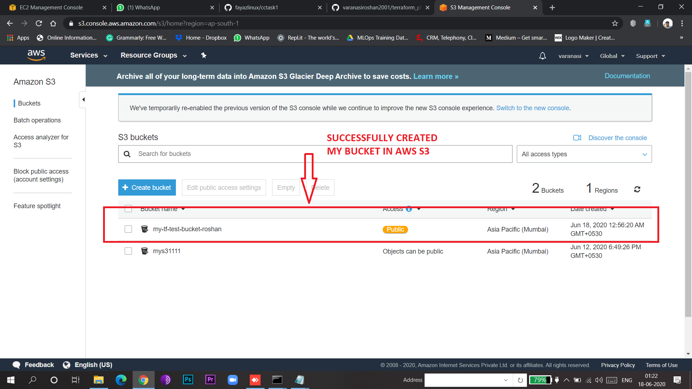
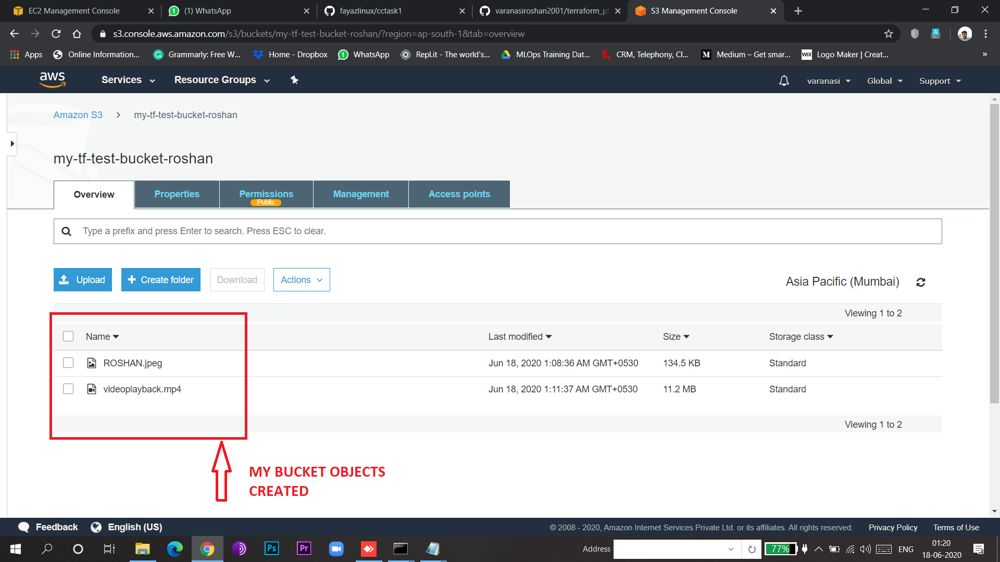
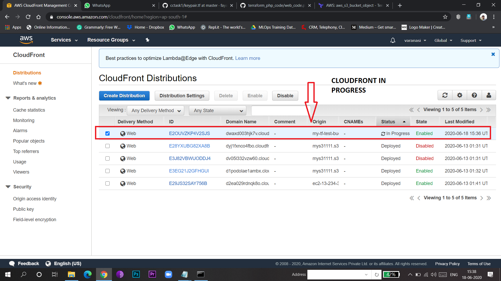
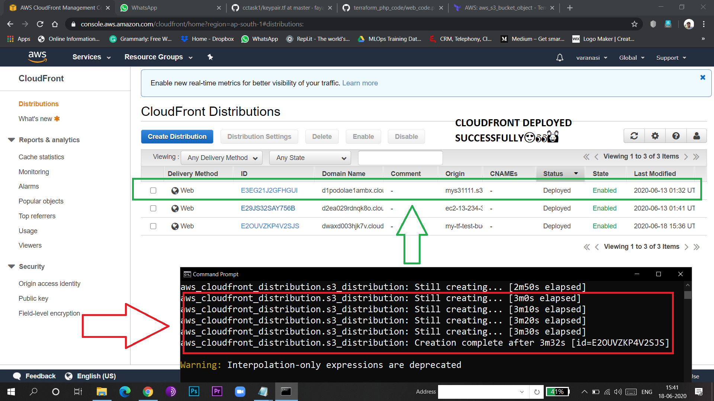
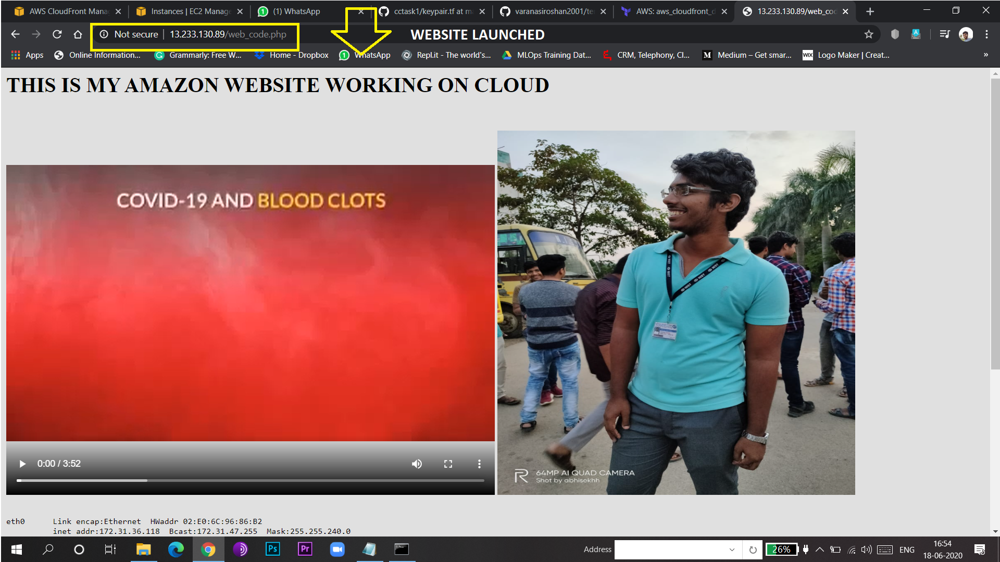
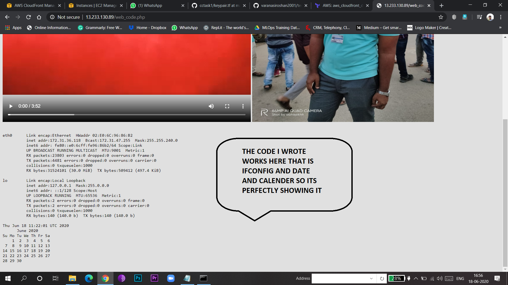

                                      THANK YOU
